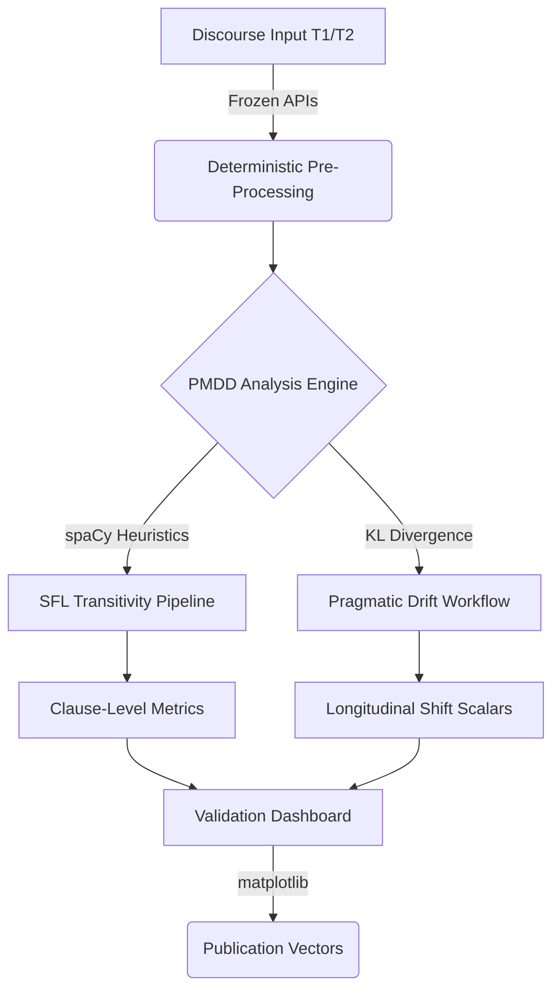
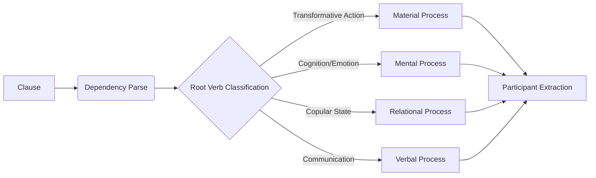
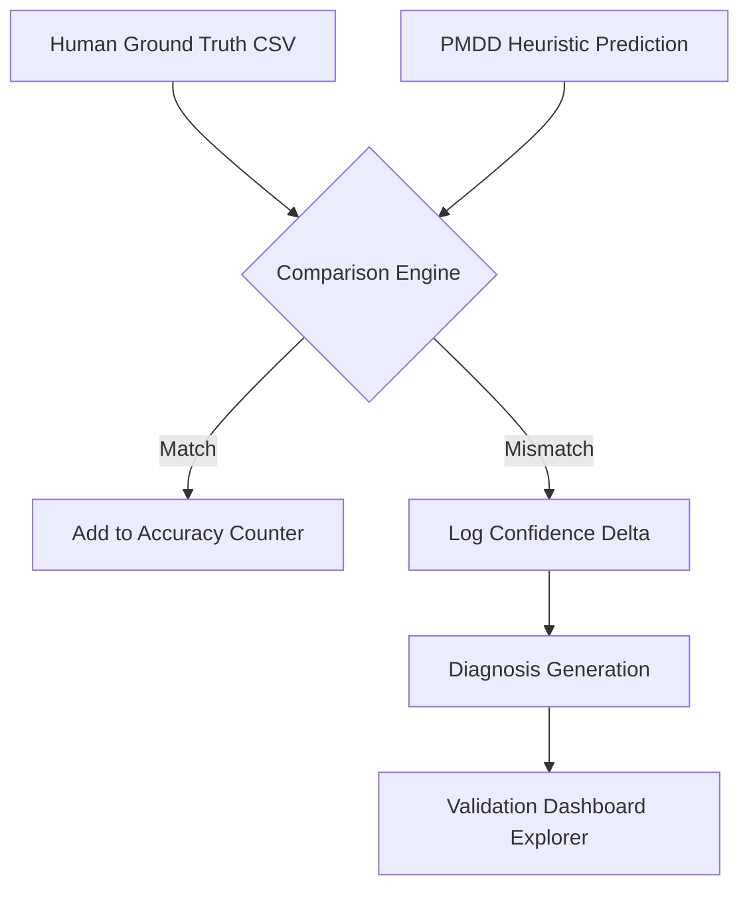
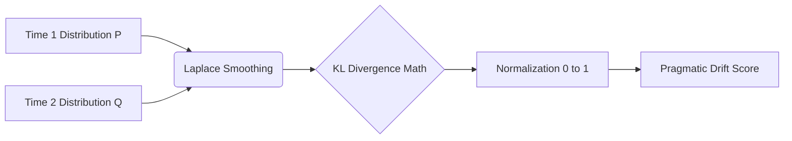
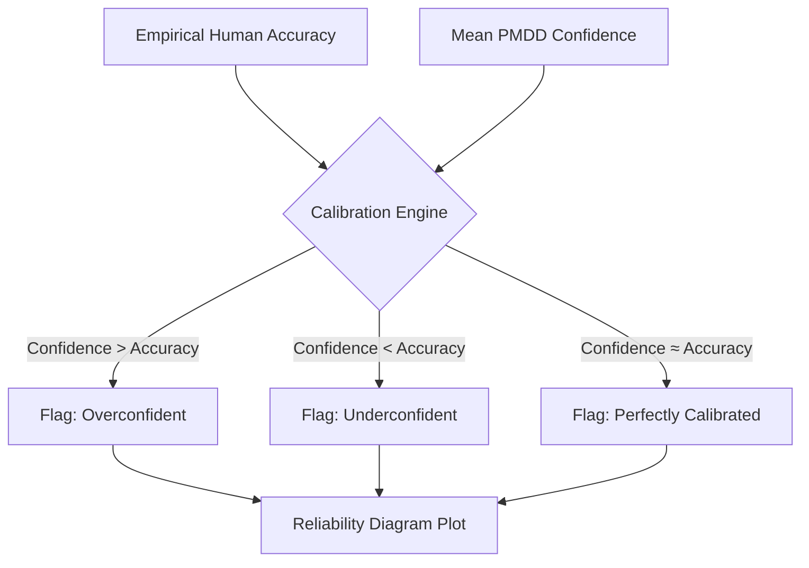

# PMDD Methodology Whitepaper: Pragmatic Meaning Drift Detector

**Version:** 3.0.0-FROZEN
**Status:** Empirically Validated Computational Discourse Intelligence Framework

## 1. Introduction
The Pragmatic Meaning Drift Detector (PMDD) is a fully deterministic, explainable computational linguistics architecture designed to measure rhetorical escalation, semantic shifting, and transitivity transformations in longitudinal discourse. This whitepaper formally documents the frozen heuristics and mathematical foundations of the platform, enabling strict reproducibility for thesis reviewers and academic peer-review.

## 2. Determinism and Architecture Freeze
PMDD enforces mathematical determinism by aggressively locking all stochastic variables upon initialization.
- **Python Hash Seed:** Locked (`os.environ['PYTHONHASHSEED'] = '42'`).
- **Standard Random / NumPy Random:** Fixed seed (`42`).
- **Heuristics:** SFL mapping rules are frozen and non-stochastic. PMDD guarantees that providing the same JSON segment payload will yield the identical 64-bit precision metrics and classifications.

### Architecture: Longitudinal Semantic Observatory


## 3. Hallidayan Transitivity Heuristics
PMDD extracts Hallidayan Process Types at the clause level by leveraging `spaCy` dependency parsing. 
1. **Material:** Flagged when root verbs are physical or transformative (e.g., *build, destroy, move*). Maps `nsubj` to Actor and `dobj` to Goal.
2. **Mental:** Flagged for cognitive or perceptive root verbs (e.g., *think, fear, know*). Maps `nsubj` to Senser.
3. **Relational:** Flagged for copular dependencies (`attr`, `acomp`), mapping states of being.

### Architecture: SFL Transitivity Pipeline


**Disagreement Analysis:** PMDD incorporates a formal disagreement explorer. For example, if a human annotates "We must consider" as Mental, but PMDD predicts Verbal, PMDD explicitly logs this false escalation.

### Architecture: Disagreement Analysis Pipeline


## 4. Pragmatic Drift Mathematics
The core scalar representing Longitudinal Pragmatic Drift is calculated via **Kullback-Leibler (KL) Divergence**:
```math
D_{KL}(P || Q) = \sum P(x) \log\left(\frac{P(x)}{Q(x)}\right)
```
Where `P` is the baseline speech act distribution (Time 1) and `Q` is the target distribution (Time 2).
- **Laplace Smoothing:** To prevent division by zero errors when a speech act vanishes entirely, a standard smoothing constant ($10^{-10}$) is uniformly applied to the distributions prior to normalization.

### Architecture: Pragmatic Drift Workflow


## 5. Confidence Calibration Science
The certainty of PMDD’s classifications is evaluated via Reliability Diagrams (Calibration Curves) and the Expected Calibration Error (ECE).
- **Overconfidence Detection:** If PMDD outputs an 80% confidence score for a Transitivity Process, but empirical benchmark validation reveals it is only correct 60% of the time, the dashboard explicitly flags the system as *overconfident*, forcing researchers to downgrade their reliance on that specific interpretation.

### Architecture: Calibration & Reliability Loop


## 6. Conclusion
PMDD is an architecture designed around one principle: transparent, verifiable empirical evidence. By eschewing uncalibrated neural classification in favor of transparent SFL heuristics and smoothed information-theoretic divergence metrics, PMDD offers an auditable laboratory instrument for researchers of computational discourse.
